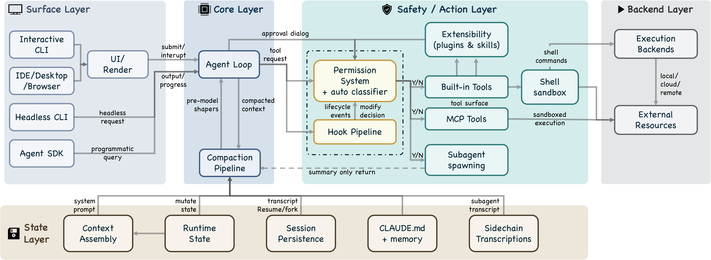

# Dive into Claude Code

<p align="center">
  
</p>

<p align="center">
  <a href="./paper/Dive_into_Claude_Code.pdf"></a>
  <a href="https://arxiv.org/abs/2604.14228"></a>
  <a href="./LICENSE"></a>
  <a href="https://github.com/VILA-Lab/Dive-into-Claude-Code/stargazers"></a>
</p>

<p align="center">
  <b>English</b> | <a href="./README_zh.md">中文</a>
</p>

> **A comprehensive source-level architectural analysis of Claude Code (v2.1.88, ~1,900 TypeScript files, ~512K lines of code), combined with a curated collection of community analyses, a design-space guide for agent builders, and cross-system comparisons.**

> [!TIP]
> **TL;DR** -- Only 1.6% of Claude Code's codebase is AI decision logic. The other 98.4% is deterministic infrastructure -- permission gates, context management, tool routing, and recovery logic. The agent loop is a simple while-loop; the real engineering complexity lives in the systems around it. This repo dissects that architecture and distills it into actionable design guidance for anyone building AI agent systems.

---

## Table of Contents

**From Our Paper**

- [🌟 Key Highlights](#key-highlights)
- [📖 Reading Guide](#reading-guide)
- [🏗️ Architecture at a Glance](#architecture-at-a-glance)
- [🧭 Values and Design Principles](#values-and-design-principles)
- [🔄 The Agentic Query Loop](#the-agentic-query-loop)
- [🛡️ Safety and Permissions](#safety-and-permissions)
- [🧩 Extensibility](#extensibility)
- [🧠 Context and Memory](#context-and-memory)
- [👥 Subagent Delegation](#subagent-delegation)
- [💾 Session Persistence](#session-persistence)

**Beyond the Paper**

- [🛰️ New Signals in the Agent Design Space](#new-signals-in-the-agent-design-space)
- [🛠️ Build Your Own AI Agent: A Design Guide](#build-your-own-ai-agent-a-design-guide)
- [⚖️ Cross-System Comparison: Claude Code vs OpenClaw vs Hermes-Agent](#cross-system-comparison-claude-code-vs-openclaw-vs-hermes-agent)
- [🌐 Community Projects & Research](#community-projects--research)
- [🚀 Other Notable AI Agent Projects](#other-notable-ai-agent-projects)
- [🔖 Citation](#citation)

---

## Key Highlights

- **98.4% Infrastructure, 1.6% AI** -- The agent loop is a simple while-loop; the real complexity is permission gates, context management, and recovery logic.
- **5 Values → 13 Principles → Implementation** -- Every design choice traces back to human authority, safety, reliability, capability, and adaptability.
- **Defense in Depth with Shared Failure Modes** -- 7 safety layers, but all share performance constraints. 50+ subcommands bypass security analysis.
- **4 CVEs Reveal a Pre-Trust Window** -- Extensions execute *before* the trust dialog appears.
- **The Cross-Cutting Harness Resists Reimplementation** -- The loop is easy to copy; hooks, classifier, compaction, and isolation are not.

---

## Reading Guide

| If you are a... | Start here | Then read |
|:----------------|:-----------|:----------|
| **Agent Builder** | [Build Your Own Agent](./docs/build-your-own-agent.md) | [Architecture Deep Dive](./docs/architecture.md) |
| **Security Researcher** | [Safety and Permissions](#safety-and-permissions) | [Architecture: Safety Layers](./docs/architecture.md#seven-independent-safety-layers) |
| **Product Manager** | [Key Highlights](#key-highlights) | [Values and Principles](#values-and-design-principles) |
| **Researcher** | [Full Paper (arXiv)](https://arxiv.org/abs/2604.14228) | [Community Resources](#community-projects--research) |

`1,884 files` ·  `~512K lines` ·  `v2.1.88` ·  `7 safety layers` ·  `5 compaction stages` ·  `54 tools` ·  `27 hook events` ·  `4 extension mechanisms` ·  `7 permission modes`

---

<details open>
<summary><h2>Architecture at a Glance</h2></summary>

Claude Code answers **four design questions** that every production coding agent must face:

| Question | Claude Code's Answer |
|:---------|:---------------------|
| Where does reasoning live? | Model reasons; harness enforces. ~1.6% AI, 98.4% infrastructure. |
| How many execution engines? | One `queryLoop` for all interfaces (CLI, SDK, IDE). |
| Default safety posture? | Deny-first: deny > ask > allow. Strictest rule wins. |
| Binding resource constraint? | ~200K (older models) / 1M (Claude 4.6 series) context window. 5 compaction layers before every model call. |

The system decomposes into **7 components** (User → Interfaces → Agent Loop → Permission System → Tools → State & Persistence → Execution Environment) across **5 architectural layers**.

<p align="center">
  
</p>

> [!NOTE]
> For the full architectural deep dive -- 7 safety layers, 9-step turn pipeline, 5-layer compaction, and more -- see **[docs/architecture.md](./docs/architecture.md)**.

<p align="right"><a href="#dive-into-claude-code-the-design-space-of-todays-ai-agent-system">↑ Back to top</a></p>

</details>

---

<details>
<summary><h2>Values and Design Principles</h2></summary>

The architecture traces from **5 human values** through **13 design principles** to implementation:

| Value | Core Idea |
|:------|:----------|
| **Human Decision Authority** | Humans retain control via principal hierarchy. When a 93% prompt-approval rate revealed approval fatigue, response was restructured boundaries, not more warnings. |
| **Safety, Security, Privacy** | System protects even when human vigilance lapses. 7 independent safety layers. |
| **Reliable Execution** | Does what was meant. Gather-act-verify loop. Graceful recovery. |
| **Capability Amplification** | "A Unix utility, not a product." 98.4% is deterministic infrastructure enabling the model. |
| **Contextual Adaptability** | CLAUDE.md hierarchy, graduated extensibility, trust trajectories that evolve over time. |

<details>
<summary><b>The 13 Design Principles</b></summary>

| Principle | Design Question |
|:----------|:----------------|
| Deny-first with human escalation | Should unrecognized actions be allowed, blocked, or escalated? |
| Graduated trust spectrum | Fixed permission level, or spectrum users traverse over time? |
| Defense in depth | Single safety boundary, or multiple overlapping ones? |
| Externalized programmable policy | Hardcoded policy, or externalized configs with lifecycle hooks? |
| Context as scarce resource | Single-pass truncation or graduated pipeline? |
| Append-only durable state | Mutable state, snapshots, or append-only logs? |
| Minimal scaffolding, maximal harness | Invest in scaffolding or operational infrastructure? |
| Values over rules | Rigid procedures or contextual judgment with deterministic guardrails? |
| Composable multi-mechanism extensibility | One API or layered mechanisms at different costs? |
| Reversibility-weighted risk assessment | Same oversight for all, or lighter for reversible actions? |
| Transparent file-based config and memory | Opaque DB, embeddings, or user-visible files? |
| Isolated subagent boundaries | Shared context/permissions, or isolation? |
| Graceful recovery and resilience | Fail hard, or recover silently? |

</details>

The paper also applies a **sixth evaluative lens** -- long-term capability preservation -- citing evidence that developers in AI-assisted conditions score 17% lower on comprehension tests.

<p align="right"><a href="#dive-into-claude-code-the-design-space-of-todays-ai-agent-system">↑ Back to top</a></p>

</details>

---

<details>
<summary><h2>The Agentic Query Loop</h2></summary>

<p align="center">
  
</p>

The core is a **ReAct-pattern while-loop**: assemble context → call model → dispatch tools → check permissions → execute → repeat. Implemented as an `AsyncGenerator` yielding streaming events.

**Before every model call**, five compaction shapers run sequentially (cheapest first): Budget Reduction → Snip → Microcompact → Context Collapse → Auto-Compact.

**9-step pipeline per turn:** Settings resolution → State init → Context assembly → 5 pre-model shapers → Model call → Tool dispatch → Permission gate → Tool execution → Stop condition

**Two execution paths:**
- `StreamingToolExecutor` -- begins executing tools as they stream in (latency optimization)
- Fallback `runTools` -- classifies tools as concurrent-safe or exclusive

**Recovery:** Max output token escalation (3 retries), reactive compaction (once per turn), prompt-too-long handling, streaming fallback, fallback model

**5 stop conditions:** No tool use, max turns, context overflow, hook intervention, explicit abort

<p align="right"><a href="#dive-into-claude-code-the-design-space-of-todays-ai-agent-system">↑ Back to top</a></p>

</details>

---

<details>
<summary><h2>Safety and Permissions</h2></summary>

<p align="center">
  
</p>

**7 permission modes** form a graduated trust spectrum: `plan` → `default` → `acceptEdits` → `auto` (ML classifier) → `dontAsk` → `bypassPermissions` (+ internal `bubble`).

**Deny-first**: A broad deny *always* overrides a narrow allow. **7 independent safety layers** from tool pre-filtering through shell sandboxing to hook interception. Permissions are **never restored on resume** -- trust is re-established per session.

> [!WARNING]
> **Shared failure modes:** Defense-in-depth degrades when layers share constraints. Per-subcommand parsing causes event-loop starvation -- commands exceeding 50 subcommands bypass security analysis entirely to prevent the REPL from freezing.

<details>
<summary><b>More details: authorization pipeline, auto-mode classifier, CVEs</b></summary>

**Authorization pipeline:** Pre-filtering (strip denied tools) → PreToolUse hooks → Deny-first rule evaluation → Permission handler (4 branches: coordinator, swarm worker, speculative classifier, interactive)

**Auto-mode classifier** (`yoloClassifier.ts`): Separate LLM call with internal/external permission templates. Two-stage: fast-filter + chain-of-thought.

**Pre-trust execution window:** 2 patched CVEs share this root cause -- hooks and MCP servers execute during initialization *before* the trust dialog appears, creating a structurally privileged attack window outside the deny-first pipeline.

</details>

<p align="right"><a href="#dive-into-claude-code-the-design-space-of-todays-ai-agent-system">↑ Back to top</a></p>

</details>

---

<details>
<summary><h2>Extensibility</h2></summary>

<p align="center">
  
</p>

**Four mechanisms at graduated context costs:** Hooks (zero) → Skills (low) → Plugins (medium) → MCP (high). Three injection points in the agent loop: **assemble()** (what the model sees), **model()** (what it can reach), **execute()** (whether/how actions run).

**Tool pool assembly** (5-step): Base enumeration (up to 54 tools) → Mode filtering → Deny pre-filtering → MCP integration → Deduplication

**27 hook events** across 5 categories with 4 execution types (shell, LLM-evaluated, webhook, subagent verifier)

**Plugin manifest** accepts 10 component types: commands, agents, skills, hooks, MCP servers, LSP servers, output styles, channels, settings, user config

**Skills:** SKILL.md with 15+ YAML frontmatter fields. Key difference -- SkillTool injects into current context; AgentTool spawns isolated context.

<p align="right"><a href="#dive-into-claude-code-the-design-space-of-todays-ai-agent-system">↑ Back to top</a></p>

</details>

---

<details>
<summary><h2>Context and Memory</h2></summary>

<p align="center">
  
</p>

**9 ordered sources** build the context window. CLAUDE.md instructions are delivered as **user context** (probabilistic compliance), not system prompt (deterministic). Memory is **file-based** (no vector DB) -- fully inspectable, editable, version-controllable.

**4-level CLAUDE.md hierarchy:** Managed (`/etc/`) → User (`~/.claude/`) → Project (`CLAUDE.md`, `.claude/rules/`) → Local (`CLAUDE.local.md`, gitignored)

**5-layer compaction** (graduated lazy-degradation): Budget reduction → Snip → Microcompact → Context Collapse (read-time projection, non-destructive) → Auto-Compact (full model summary, last resort)

**Memory retrieval:** LLM-based scan of memory-file headers, selects up to 5 relevant files. No embeddings, no vector similarity.

<p align="right"><a href="#dive-into-claude-code-the-design-space-of-todays-ai-agent-system">↑ Back to top</a></p>

</details>

---

<details>
<summary><h2>Subagent Delegation</h2></summary>

<p align="center">
  
</p>

**6 built-in types** (Explore, Plan, General-purpose, Guide, Verification, Statusline) + custom agents via `.claude/agents/*.md`. **Sidechain transcripts**: only summaries return to parent (parent's context is *protected* from subagent verbosity). Three isolation modes: worktree, remote, in-process. Coordination via POSIX `flock()`.

**SkillTool vs AgentTool:** SkillTool injects into current context (cheap). AgentTool spawns isolated context (expensive, but prevents context explosion).

**Permission override:** Subagent `permissionMode` applies UNLESS parent is in `bypassPermissions`/`acceptEdits`/`auto` (explicit user decisions always take precedence).

**Custom agents:** YAML frontmatter supports tools, disallowedTools, model, effort, permissionMode, mcpServers, hooks, maxTurns, skills, memory scope, background flag, isolation mode.

<p align="right"><a href="#dive-into-claude-code-the-design-space-of-todays-ai-agent-system">↑ Back to top</a></p>

</details>

---

<details>
<summary><h2>Session Persistence</h2></summary>

<p align="center">
  
</p>

Three channels: append-only JSONL transcripts, global prompt history, subagent sidechains. **Permissions never restored on resume** -- trust is re-established per session. Design favors **auditability over query power**.

**Chain patching:** Compact boundaries record `headUuid`/`anchorUuid`/`tailUuid`. The session loader patches the message chain at read time. Nothing is destructively edited on disk.

**Checkpoints:** File-history checkpoints for `--rewind-files`, stored at `~/.claude/file-history/<sessionId>/`.

<p align="right"><a href="#dive-into-claude-code-the-design-space-of-todays-ai-agent-system">↑ Back to top</a></p>

</details>

---

<details>
<summary><h2>New Signals in the Agent Design Space</h2></summary>

New agent-system developments reinforce the same lesson Claude Code makes clear: agent capability is not a model property alone. It comes from the runtime, context layer, execution boundary, tool supply chain, the controls humans have over it, and the evaluation loop around the model.

| Design Implication | What it means for agent builders | Representative signals |
|:---|:---|:---|
| **Runtime and control plane are first-class design concerns** | Durable execution, checkpoints, sandboxes, agent inventory, policy, and observability should be designed as parts of the system that users can see, not hidden deployment details. | [Cursor cloud agents](https://cursor.com/blog/cloud-agent-lessons), [Google Managed Agents](https://blog.google/innovation-and-ai/technology/developers-tools/managed-agents-gemini-api/), [Microsoft Agent 365](https://www.microsoft.com/en-us/security/blog/2026/05/01/microsoft-agent-365-now-generally-available-expands-capabilities-and-integrations/), [Databricks Omnigent](https://www.databricks.com/blog/introducing-omnigent-meta-harness-combine-control-and-share-your-agents) |
| **Context is managed infrastructure** | Prompts, files, skills, IDE indexes, workspace state, memory namespaces, and interpreter state need lifecycle, provenance, review, and rollback. | [LangChain Context Hub](https://www.langchain.com/blog/introducing-context-hub), [AWS AgentCore](https://aws.amazon.com/blogs/machine-learning/break-the-context-window-barrier-with-amazon-bedrock-agentcore/), [Anthropic managed-agent memory](https://platform.claude.com/docs/en/managed-agents/memory) |
| **Execution boundary is the safety boundary** | Permissions, network reachability, filesystem access, credential custody, tenant isolation, and OS sandboxing are core architecture, not late-stage hardening. | [Codex Windows sandbox](https://openai.com/index/building-codex-windows-sandbox/), [Running Codex safely](https://openai.com/index/running-codex-safely/), [Anthropic self-hosted sandboxes](https://platform.claude.com/docs/en/managed-agents/self-hosted-sandboxes) |
| **Tools and skills are a supply chain** | MCP servers, skills, plugins, and agent-to-agent protocols need registries, allowlists, identity, semantic review, versioning, and revocation. | [NSA MCP security](https://www.nsa.gov/Portals/75/documents/Cybersecurity/CSI_MCP_SECURITY.pdf), [GitHub MCP allowlists](https://github.blog/changelog/2026-04-16-copilot-cli-supports-custom-registry-based-mcp-allowlists/), [A2A milestone](https://www.linuxfoundation.org/press/a2a-protocol-surpasses-150-organizations-lands-in-major-cloud-platforms-and-sees-enterprise-production-use-in-first-year) |
| **Humans become managers and verifiers** | Agent products should support goals, plans, approvals, interrupts, reviewable diffs, escalation, and constrained multi-agent write authority. | [Codex from anywhere](https://openai.com/index/work-with-codex-from-anywhere/), [Copilot cloud agent](https://github.blog/changelog/2026-04-01-research-plan-and-code-with-copilot-cloud-agent), [Cognition multi-agents](https://cognition.ai/blog/multi-agents-working) |
| **Observability must close the improvement loop** | Traces should feed evaluation, failure clustering, policy enforcement, and prompt/tool repair rather than ending as passive logs. | [LangSmith Engine](https://www.langchain.com/blog/how-we-built-langsmith-engine-our-agent-for-improving-agents), [OpenAI agent improvement loop](https://developers.openai.com/cookbook/examples/agents_sdk/agent_improvement_loop), [AWS AgentCore Evaluations](https://aws.amazon.com/blogs/machine-learning/build-reliable-ai-agents-with-amazon-bedrock-agentcore-evaluations/) |

These signals do not replace Claude Code's design space; they make its boundaries clearer. The agent loop is the small part. The harness around it is where most capability, safety, and reliability decisions now live. For month-level source notes, see **[docs/agent-design-space-source-notes_zh.md](./docs/agent-design-space-source-notes_zh.md)**.

<p align="right"><a href="#dive-into-claude-code-the-design-space-of-todays-ai-agent-system">↑ Back to top</a></p>

</details>

---

<details>
<summary><h2>Build Your Own AI Agent: A Design Guide</h2></summary>

> Not a coding tutorial. A guide to the **design decisions** you must make, derived from architectural analysis.

Every production agent must navigate these decisions:

| Decision | The Question | Key Insight |
|:---------|:-------------|:------------|
| [**Reasoning placement**](./docs/build-your-own-agent.md#decision-1-where-does-reasoning-live) | How much logic in the model vs. harness? | As models converge in capability, the harness becomes the differentiator. |
| [**Safety posture**](./docs/build-your-own-agent.md#decision-2-what-is-your-safety-posture) | How do you prevent harmful actions? | Defense-in-depth fails when layers share failure modes. |
| [**Context management**](./docs/build-your-own-agent.md#decision-3-how-do-you-manage-context) | What does the model see? | Design for context scarcity from day one. Graduated > single-pass. |
| [**Extensibility**](./docs/build-your-own-agent.md#decision-4-how-do-you-handle-extensibility) | How do extensions plug in? | Not all extensions need to consume context tokens. |
| [**Subagent architecture**](./docs/build-your-own-agent.md#decision-5-how-do-subagents-work) | Shared or isolated context? | Agent teams in plan mode cost ~7× tokens. Subagent summary-only returns prevent context blow-up. |
| [**Session persistence**](./docs/build-your-own-agent.md#decision-6-how-do-sessions-persist) | What carries over? | Never restore permissions on resume. Auditability > query power. |

**Read the full guide: [docs/build-your-own-agent.md](./docs/build-your-own-agent.md)**

<p align="right"><a href="#dive-into-claude-code-the-design-space-of-todays-ai-agent-system">↑ Back to top</a></p>

</details>

---

<details>
<summary><h2>Cross-System Comparison: Claude Code vs OpenClaw vs Hermes-Agent</h2></summary>

The same recurring design questions admit different architectural answers when the deployment context changes. The table below contrasts Claude Code v2.1.88 with two notable peers — [OpenClaw](https://github.com/openclaw/openclaw), a local-first multi-channel personal-assistant gateway, and [NousResearch/hermes-agent](https://github.com/NousResearch/hermes-agent), a self-improving multi-deployment agent — across the six design dimensions Section 10 of the paper uses for the OpenClaw comparison. Cells are source-grounded; this is not a feature scoreboard.

| Design Dimension | Claude Code (v2.1.88) [](https://github.com/anthropics/claude-code) | OpenClaw [](https://github.com/openclaw/openclaw) | Hermes-Agent [](https://github.com/NousResearch/hermes-agent) |
|:---|:---|:---|:---|
| **System scope & deployment** | Per-user CLI / SDK / IDE interface for coding; one `queryLoop` async generator across entry points. | Local-first WebSocket gateway (default port 18789, loopback-bound by default; other binds available); routes ~23 messaging channels to an embedded agent runtime; companion apps for macOS, iOS, Android. | Three entry points: `hermes` (interactive CLI), `hermes-agent` (programmatic runtime), `hermes-acp` (ACP server); gateway adapters route messages to per-session AIAgent instances cached LRU-style (max 128, 1 h idle TTL); also runs as MCP server via `hermes mcp serve`. |
| **Trust model & security** | Deny-first per-action evaluation; 7 permission modes; LLM-based auto-mode classifier (`yoloClassifier` / `sideQuery`); session-scoped permission state (session bypass flag, app allowlist state) is not restored on resume. | Single trusted operator per gateway; DM pairing codes, sender allowlists, gateway authentication; per-agent allow / deny tool policy; opt-in sandboxing via Docker / SSH / OpenShell, off by default; `non-main` mode sandboxes only non-main sessions; hostile multi-tenant isolation explicitly not supported. | Dangerous-command pattern detection with per-session approval state; CLI interactive prompts and gateway async prompts; auxiliary-LLM smart approval auto-approves low-risk commands; permanent allowlist persisted in `config.yaml`; subagent worker threads default to auto-deny dangerous commands (opt-in `subagent_auto_approve` for batch / cron runs). |
| **Agent runtime & tools** | Single `queryLoop` async generator with streamed event yields; environment- and feature-gated tool registry; before-API compaction (Snip, Microcompact, Context Collapse, Auto-Compact) runs conditionally, with Auto-Compact first attempting session-memory compaction. | Embedded agent runtime inside the gateway's RPC dispatch (the `agent` RPC validates parameters, accepts immediately, runs asynchronously, and streams lifecycle / stream events back over the gateway protocol); per-session queue serialization with an optional global lane. | While-loop with explicit per-turn iteration budget and grace-call slot; per-turn checkpoint dedup; gateway `step_callback` hook fires on each iteration; auxiliary-model context compression summarizes middle turns while protecting head and tail. |
| **Extension architecture** | Four mechanisms at graduated context cost: hooks → skills → plugins → MCP; 27 hook events; 10 plugin component types. | Manifest-first plugin system with 12 documented capability categories; central registry exposes tools, channels, provider setup, hooks, HTTP routes, CLI commands, services; separate skills layer with multiple sources (workspace highest precedence) plus the ClawHub public registry; `openclaw mcp` provides both an MCP server interface and an outbound client registry for other MCP servers. | 12 bundled plugins under `plugins/` (context_engine, disk-cleanup, example-dashboard, google_meet, hermes-achievements, image_gen, kanban, memory, observability, platforms, spotify, strike-freedom-cockpit); MCP server (`mcp_serve.py`) exposes 10 tools; ACP adapter (`acp_adapter/`) exposes Hermes as an ACP server. |
| **Memory & context** | 4-level CLAUDE.md hierarchy; before-API compaction (Snip, Microcompact, Context Collapse, Auto-Compact); LLM-based selection from file-based Markdown memory files. | Workspace bootstrap files (AGENTS.md, SOUL.md, TOOLS.md, IDENTITY.md, USER.md) plus conditional BOOTSTRAP.md / HEARTBEAT.md / MEMORY.md; separate memory system (MEMORY.md, daily notes under `memory/YYYY-MM-DD.md`, optional DREAMS.md); hybrid vector + keyword search when an embedding provider is configured; experimental dreaming for long-term promotion; pluggable compaction providers. | SQLite state store with FTS5 full-text search and WAL-mode concurrent readers; sessions linked by `parent_session_id` chains for compression-triggered splits; 8 swappable memory backends under `plugins/memory/` (byterover, hindsight, holographic, honcho, mem0, openviking, retaindb, supermemory); auxiliary-LLM compression as a separate context-management layer. |
| **Multi-agent architecture** | Sub-agent delegation via sidechain transcripts; 6 built-in agent definitions (availability conditional on build / mode) plus custom; a single summary message returns to parent (in-process / viewable transcript cases preserve more internal detail); agent-isolation settings include `worktree` and `remote`, with an `in-process` teammate backend in the swarm path. | Two layers. (1) Multi-agent routing: per-channel isolated agents with their own workspace, auth profiles, session store, and model configuration, dispatched via deterministic binding rules. (2) Sub-agent delegation: `maxSpawnDepth` range 1–5, default 1, recommended 2; tool policy varies by depth; project vision (VISION.md) rejects agent-hierarchy frameworks as the default. | `delegate_task` tool spawns child AIAgent instances in a `ThreadPoolExecutor` (parent blocks until children complete); each child has fresh conversation history, its own `task_id`, and a restricted toolset (`DELEGATE_BLOCKED_TOOLS` strips `delegate_task`, `clarify`, `memory`, `send_message`, `execute_code`); default depth `MAX_DEPTH = 1` (configurable up to cap 3); default 3 concurrent children. |

**What this contrast reveals.** Three observations follow from the table. First, **deployment context** drives the rest of the design: a per-user coding CLI converges on per-action approval and a single execution loop, a multi-channel gateway converges on perimeter trust and channel-bound agents, and a multi-deployment messaging-and-cloud agent converges on opt-in container/cloud isolation, an LLM-based smart approval, and a swappable-backend memory layer. Second, the **extension layer is where each system most clearly differentiates**: Claude Code stratifies four mechanisms by context cost, OpenClaw treats extension as registry-managed capabilities at the gateway, and Hermes-Agent ships bundled plugins plus dual MCP server / ACP server interfaces other agents can connect to. Third, **memory architectures sit on a spectrum**: file-based and inspectable Markdown (Claude Code), file-based plus optional vector + experimental dreaming (OpenClaw), or full-text indexed (FTS5) plus eight swappable plugin backends including dedicated vector / RAG providers (Hermes-Agent). The table is best read not as a scoreboard but as three different fixed points in the same design space.

<p align="right"><a href="#dive-into-claude-code-the-design-space-of-todays-ai-agent-system">↑ Back to top</a></p>

</details>

---

<details>
<summary><h2>Community Projects & Research</h2></summary>

A curated map of the repos, reimplementations, and academic papers surrounding Claude Code's architecture.

### Official Anthropic Resources

Primary sources referenced throughout the paper — Anthropic's own engineering and research publications, plus product documentation.

#### Research & Engineering Blogs

| Article | Topic |
|:--------|:------|
| [Building Effective Agents](https://www.anthropic.com/research/building-effective-agents) | Foundational: simple composable patterns over heavy frameworks. |
| [Effective Context Engineering for AI Agents](https://www.anthropic.com/engineering/effective-context-engineering-for-ai-agents) | Context curation and token-budget management. |
| [Prompt Caching with Claude](https://www.anthropic.com/news/prompt-caching) | Cache reads at 10% cost, writes at 125%; 5-min default TTL. The platform feature that makes Claude Code's cache-aware compaction architecturally meaningful. |
| [Harness Design for Long-Running Application Development](https://anthropic.com/engineering/harness-design-long-running-apps) | Harness architecture for autonomous full-stack dev; multi-agent patterns. |
| [Claude Code Auto Mode: A Safer Way to Skip Permissions](https://www.anthropic.com/engineering/claude-code-auto-mode) | ML-classifier approval automation; source of the 93% approval-rate finding. |
| [Beyond Permission Prompts: Making Claude Code More Secure and Autonomous](https://www.anthropic.com/engineering/claude-code-sandboxing) | Sandbox-based security; 84% reduction in permission prompts. |
| [How We Contain Claude Across Products](https://www.anthropic.com/engineering/how-we-contain-claude) | Containment across claude.ai, Claude Code, and Cowork (May 2026); Claude Code's human-in-the-loop sandbox, approval fatigue, and capping the blast radius. |
| [Measuring AI Agent Autonomy in Practice](https://anthropic.com/research/measuring-agent-autonomy) | Longitudinal usage: auto-approve rates grow from ~20% to 40%+ with experience. |
| [Our Framework for Developing Safe and Trustworthy Agents](https://www.anthropic.com/news/our-framework-for-developing-safe-and-trustworthy-agents) | Governance framework for responsible agent deployment. |
| [When AI Builds Itself](https://www.anthropic.com/institute/recursive-self-improvement) | Anthropic Institute on recursive self-improvement: AI accelerating AI development, the direction-setting and research-taste gaps, and governance scenarios. |
| [Scaling Managed Agents: Decoupling the Brain from the Hands](https://www.anthropic.com/engineering/managed-agents) | Hosted-service architecture separating reasoning, execution, and session. |
| [An Update on Recent Claude Code Quality Reports](https://www.anthropic.com/engineering/april-23-postmortem) | Postmortem on three bugs behind perceived quality drops: a reasoning-effort default, a cache optimization bug, and a system-prompt change. |
| [Introducing Claude Opus 4.8](https://www.anthropic.com/news/claude-opus-4-8) | May 2026 model update: sharper judgment and honesty (~4x fewer unremarked code flaws), longer autonomous runs; introduces dynamic workflows in research preview. |
| [Claude Fable 5 and Claude Mythos 5](https://www.anthropic.com/news/claude-fable-5-mythos-5) | June 2026 Mythos-class tier sitting above Opus; Fable 5 is the general-use configuration (risky queries fall back to Opus 4.8), with state-of-the-art software-engineering and agentic-coding performance. Access was suspended globally on June 12, 2026 (see next row). |
| [Statement on Suspending Access to Fable 5 and Mythos 5](https://www.anthropic.com/news/fable-mythos-access) | Anthropic's statement on suspending Fable 5 and Mythos 5. A US export-control directive (June 12, 2026) restricted access for foreign nationals, but Anthropic disabled both models for all users worldwide, just days after launch. A rare case of regulation forcing a deployed frontier model offline, and a concrete example of the compliance and safety pressures that agent systems face in deployment. |

#### Product Documentation

| Document | Topic |
|:---------|:------|
| [How Claude Code Works](https://code.claude.com/docs/en/how-claude-code-works) | Official overview of the agent loop, tools, and terminal automation. |
| [Permissions](https://code.claude.com/docs/en/permissions) | Tiered permission system, modes, granular rules. |
| [Hooks](https://code.claude.com/docs/en/hooks) | 27-event hook reference, execution models, lifecycle events. |
| [Memory](https://code.claude.com/docs/en/memory) | CLAUDE.md hierarchy, auto memory, learned preferences. |
| [Sub-agents](https://code.claude.com/docs/en/sub-agents) | Specialized isolated assistants, custom prompts, tool access. |
| [Orchestrate Subagents at Scale with Dynamic Workflows](https://code.claude.com/docs/en/workflows) | Claude writes a JavaScript orchestration script; a background runtime fans out to up to 1,000 subagents, with intermediate state held in script variables outside the context window (v2.1.154+, research preview). |
| [What's New in Claude Opus 4.8](https://platform.claude.com/docs/en/about-claude/models/whats-new-claude-4-8) | Mid-conversation system messages (prompt-cache-preserving), lower cacheable-prompt minimum, fewer compactions and better compaction recovery. |
| [Claude Code CHANGELOG](https://github.com/anthropics/claude-code/blob/main/CHANGELOG.md) | Release notes; dynamic workflows and Opus 4.8 land in v2.1.154. |

### Architecture Analysis

Deep dives into Claude Code's internal design.

| Repository | Description |
|:-----------|:------------|
| [**ComeOnOliver/claude-code-analysis**](https://github.com/ComeOnOliver/claude-code-analysis) [](https://github.com/ComeOnOliver/claude-code-analysis) | Comprehensive reverse-engineering: source tree structure, module boundaries, tool inventories, and architectural patterns. |
| [**alejandrobalderas/claude-code-from-source**](https://github.com/alejandrobalderas/claude-code-from-source) [](https://github.com/alejandrobalderas/claude-code-from-source) | 18-chapter technical book (~400 pages). All original pseudocode, no proprietary source. |
| [**liuup/claude-code-analysis**](https://github.com/liuup/claude-code-analysis) [](https://github.com/liuup/claude-code-analysis) | Chinese-language deep-dive — startup flow, query main loop, MCP integration, multi-agent architecture. |
| [**sanbuphy/claude-code-source-code**](https://github.com/sanbuphy/claude-code-source-code) [](https://github.com/sanbuphy/claude-code-source-code) | Quadrilingual analysis (EN/JA/KO/ZH) — multi-domain reports covering telemetry, codenames, KAIROS, unreleased tools. |
| [**cablate/claude-code-research**](https://github.com/cablate/claude-code-research) [](https://github.com/cablate/claude-code-research) | Independent research on internals, Agent SDK, and related tooling. |
| [**Yuyz0112/claude-code-reverse**](https://github.com/Yuyz0112/claude-code-reverse) [](https://github.com/Yuyz0112/claude-code-reverse) | Visualize Claude Code's LLM interactions — log parser and visual tool to trace prompts, tool calls, and compaction. |
| [**Piebald-AI/claude-code-system-prompts**](https://github.com/Piebald-AI/claude-code-system-prompts) [](https://github.com/Piebald-AI/claude-code-system-prompts) | Version-tracked prompt corpus across 170+ Claude Code releases — main system prompt, builtin tool descriptions, sub-agent prompts (Plan/Explore/Task), and ~40 system reminders. Updated within minutes of each release. |

### Open-Source Reimplementations

Clean-room rewrites and buildable research forks.

| Repository | Description |
|:-----------|:------------|
| [**chauncygu/collection-claude-code-source-code**](https://github.com/chauncygu/collection-claude-code-source-code) [](https://github.com/chauncygu/collection-claude-code-source-code) | Meta-collection of community Claude Code source artifacts -- includes claw-code (Rust port), nano-claude-code (Python), and the extracted original source archive. |
| [**777genius/claude-code-working**](https://github.com/777genius/claude-code-working) [](https://github.com/777genius/claude-code-working) | Working reverse-engineered CLI. Runnable with Bun, 450+ chunk files, 31 feature flags polyfilled. |
| [**T-Lab-CUHKSZ/claude-code**](https://github.com/T-Lab-CUHKSZ/claude-code) [](https://github.com/T-Lab-CUHKSZ/claude-code) | CUHK-Shenzhen buildable research fork — reconstructed build system from raw TypeScript snapshot. |
| [**ruvnet/open-claude-code**](https://github.com/ruvnet/open-claude-code) [](https://github.com/ruvnet/open-claude-code) | Nightly auto-decompile rebuild — 903+ tests, 25 tools, 4 MCP transports, 6 permission modes. |
| [**Enderfga/openclaw-claude-code**](https://github.com/Enderfga/openclaw-claude-code) [](https://github.com/Enderfga/openclaw-claude-code) | OpenClaw plugin — unified ISession interface for Claude/Codex/Gemini/Cursor. Multi-agent council. |
| [**memaxo/claude_code_re**](https://github.com/memaxo/claude_code_re) [](https://github.com/memaxo/claude_code_re) | Reverse engineering from minified bundles — deobfuscation of the publicly distributed cli.js file. |
| [**agentforce314/clawcodex**](https://github.com/agentforce314/clawcodex) [](https://github.com/agentforce314/clawcodex) | Python rebuild with multi-provider LLM support. |

### Claude Code Guides & Learning

Tutorials and hands-on learning paths for Claude Code itself.

| Repository | Description |
|:-----------|:------------|
| [**shareAI-lab/learn-claude-code**](https://github.com/shareAI-lab/learn-claude-code) [](https://github.com/shareAI-lab/learn-claude-code) | "Bash is all you need" — 19-chapter 0-to-1 course with runnable Python agents, web platform. ZH/EN/JA. |
| [**FlorianBruniaux/claude-code-ultimate-guide**](https://github.com/FlorianBruniaux/claude-code-ultimate-guide) [](https://github.com/FlorianBruniaux/claude-code-ultimate-guide) | Beginner-to-power-user guide with production-ready templates, agentic workflow guides, and cheatsheets. |
| [**affaan-m/everything-claude-code**](https://github.com/affaan-m/everything-claude-code) [](https://github.com/affaan-m/everything-claude-code) | Agent harness optimization — skills, instincts, memory, security, and research-first development. |

### General Harness Engineering Design Space Resources

External resources that complement this paper's design-space analysis — concept essays, curricula, and code that illuminate the harness layer as an engineering practice.

| Repository | Description |
|:-----------|:------------|
| [**deusyu/harness-engineering**](https://github.com/deusyu/harness-engineering) [](https://github.com/deusyu/harness-engineering) | Learning archive — original concept essays, independent thinking pieces, and curated translations of harness-engineering writing; from concept to independent practice. |
| [**walkinglabs/learn-harness-engineering**](https://github.com/walkinglabs/learn-harness-engineering) [](https://github.com/walkinglabs/learn-harness-engineering) | Project-based English course with PDF coursebooks, syllabus, and capstone, organized around five harness subsystems: instructions, state, verification, scope, and session lifecycle. |
| [**china-qijizhifeng/agentic-harness-engineering**](https://github.com/china-qijizhifeng/agentic-harness-engineering) [](https://github.com/china-qijizhifeng/agentic-harness-engineering) | Observability system that auto-evolves a coding agent's harness — a meta-agent reads execution traces and rewrites system prompts, tools, middleware, skills, sub-agents, and memory. |
| [**ZhangHanDong/harness-engineering-from-cc-to-ai-coding**](https://github.com/ZhangHanDong/harness-engineering-from-cc-to-ai-coding) [](https://github.com/ZhangHanDong/harness-engineering-from-cc-to-ai-coding) | The "Horse Book" (《马书》) — Chinese mdBook framing Claude Code v2.1.88 as a Harness Engineering case study; covers architecture, prompt engineering, context management, prompt cache, security, and lessons for builders. |
| [**alchaincyf/loop-engineering-orange-book**](https://github.com/alchaincyf/loop-engineering-orange-book) [](https://github.com/alchaincyf/loop-engineering-orange-book) | 花叔 (HuaShu)'s plain-language guide to loop engineering, in both Chinese and English. It puts the loop one layer above the harness, walks through what a loop does and the pieces it needs, and credits Steinberger, Osmani, and Anthropic's Claude Code team. |

### Blog Posts & Technical Articles

| Article | What Makes It Valuable |
|:--------|:----------------------|
| [Marco Kotrotsos — "Claude Code Internals" (15-part series)](https://kotrotsos.medium.com/claude-code-internals-part-1-high-level-architecture-9881c68c799f) | Most systematic pre-leak analysis. Architecture, agent loop, permissions, sub-agents, MCP, telemetry. |
| [Alex Kim — "The Claude Code Source Leak"](https://alex000kim.com/posts/2026-03-31-claude-code-source-leak/) | Anti-distillation mechanisms, frustration detection, Undercover Mode, ~250K wasted API calls/day. |
| [Haseeb Qureshi — Cross-agent architecture comparison](https://gist.github.com/Haseeb-Qureshi/2213cc0487ea71d62572a645d7582518) | Claude Code vs Codex vs Cline vs OpenCode — architecture-level comparison. |
| [George Sung — "Tracing Claude Code's LLM Traffic"](https://medium.com/@georgesung/tracing-claude-codes-llm-traffic-agentic-loop-sub-agents-tool-use-prompts-7796941806f5) | Complete system prompts and full API logs. Discovered dual-model usage (Opus + Haiku). |
| [Agiflow — "Reverse Engineering Prompt Augmentation"](https://agiflow.io/blog/claude-code-internals-reverse-engineering-prompt-augmentation/) | 5 prompt augmentation mechanisms backed by actual network traces. |
| [Engineer's Codex — "Diving into the Source Code Leak"](https://read.engineerscodex.com/p/diving-into-claude-codes-source-code) | Modular system prompt, ~40 tools, large query/tool subsystem, anti-distillation. |
| [MindStudio — "Three-Layer Memory Architecture"](https://www.mindstudio.ai/blog/claude-code-source-leak-memory-architecture) | In-context memory, MEMORY.md pointer index, CLAUDE.md static config. Best single resource on memory. |
| [WaveSpeed — "Claude Code Architecture: Leaked Source Deep Dive"](https://wavespeed.ai/blog/posts/claude-code-architecture-leaked-source-deep-dive/) | 512K-line TS source deep dive; context compression and anti-distillation. |
| [Zain Hasan — "Inside Claude Code: An Architecture Deep Dive"](https://zainhas.github.io/blog/2026/inside-claude-code-architecture/) | Layered architecture, 5 entry modes, multi-agent walkthrough. |
| [Addy Osmani — "Agent Harness Engineering"](https://addyosmani.com/blog/agent-harness-engineering/) | Frames harness engineering as a discipline with named primitives (filesystem/git state, sandboxes, AGENTS.md memory, compaction, planning loops, hooks); cites Claude Code as the canonical mature example. |
| [Addy Osmani — "Loop Engineering"](https://addyosmani.com/blog/loop-engineering/) | The essay that named "loop engineering": instead of writing prompts for the agent yourself, you build the loop that prompts it for you. Its parts (automations, worktrees, skills, connectors, sub-agents, and a file that tracks progress) are the harness pieces this paper analyzes. |
| [Armin Ronacher — "The Coming Loop"](https://lucumr.pocoo.org/2026/6/23/the-coming-loop/) | Splits the agent loop (tool calls inside one run) from the harness loop (a system that keeps re-prompting the agent to run again). Ronacher is skeptical: loops work well for porting code, tuning performance, and scanning for security bugs, but the code they leave behind tends to be more defensive and harder to maintain, so people still have to read it and decide what to keep. |
| [LangChain — "The Art of Loop Engineering"](https://www.langchain.com/blog/the-art-of-loop-engineering) | Describes four loops built around an agent: the agent loop, a verification loop that scores the output and retries, an event-driven loop that starts agents on outside triggers, and a hill-climbing loop that reads production traces to improve the harness itself. The point: most of the value comes from these loops, not the model on its own. |
| [Andrej Karpathy — "Sequoia Ascent 2026"](https://karpathy.bearblog.dev/sequoia-ascent-2026/) | Argues for "agentic engineering": humans orchestrate and verify rather than write code. "LLMs and reinforcement learning automate what you can verify"; "you can outsource your thinking, but you can't outsource your understanding." |

### Cross-Vendor Code-Agent Engineering

Official engineering posts from other vendors building code agents — useful for seeing how the same design questions are answered outside Claude Code.

| Resource | Vendor | What's Notable |
|:---------|:-------|:---------------|
| [Harness Engineering: Leveraging Codex in an Agent-First World](https://openai.com/index/harness-engineering/) | OpenAI | Frames the "harness" as the constraints, feedback loops, and documentation that make agents reliable; reports a roughly 1M-line beta built with essentially no hand-written code. |
| [Best Practices for Coding with Agents](https://cursor.com/blog/agent-best-practices) | Cursor | Articulates an agent harness as three components — Instructions, Tools, and Model — orchestrated per model. |
| [Build with Google Antigravity](https://developers.googleblog.com/build-with-google-antigravity-our-new-agentic-development-platform/) | Google | Agent-first platform: a Manager view for asynchronous multi-agent orchestration, with Artifacts (plans, screenshots, recordings) as the verification mechanism instead of raw logs. |
| [Microsoft Agent Framework at BUILD 2026: Agent Harness, Hosted Agents, CodeAct](https://devblogs.microsoft.com/agent-framework/microsoft-agent-framework-at-build-2026-announce/) | Microsoft | Adds a built-in "agent harness" with automatic context compaction, file-based memory, plan and execute modes, skill discovery, parallel sub-agents, and a sandboxed shell. Also adds CodeAct, which lets the model run several tool calls as one Python program inside a fresh Hyperlight micro-VM each call. |
| [Codex Security: Now in Research Preview](https://openai.com/index/codex-security-now-in-research-preview/) | OpenAI | Application-security agent that builds a project-specific threat model, then finds and pressure-tests vulnerabilities in sandboxed validation environments. |

### Related Academic Papers

| Paper | Venue | Relevance |
|:------|:------|:----------|
| [Architectural Design Decisions in AI Agent Harnesses](https://arxiv.org/abs/2604.18071) | arXiv | Source-grounded study of 70 agent-system projects identifying recurring design dimensions; closest contemporary peer to this paper's design-space framing. |
| [Decoding the Configuration of AI Coding Agents](https://arxiv.org/abs/2511.09268) | arXiv | Empirical study of 328 Claude Code configuration files — SE concerns and co-occurrence patterns. |
| [On the Use of Agentic Coding Manifests](https://arxiv.org/abs/2509.14744) | arXiv | Analyzed 253 CLAUDE.md files from 242 repos — structural patterns in operational commands. |
| [Context Engineering for Multi-Agent Code Assistants](https://arxiv.org/abs/2508.08322) | arXiv | Multi-agent workflow combining multiple LLMs for code generation. |
| [OpenHands: An Open Platform for AI Software Developers](https://arxiv.org/abs/2407.16741) | ICLR 2025 | Primary academic reference for open-source AI coding agents. |
| [SWE-Agent: Agent-Computer Interfaces](https://arxiv.org/abs/2405.15793) | NeurIPS 2024 | Docker-based coding agent with custom agent-computer interface. |

### How This Paper Differs

> While the projects above focus on **engineering reverse-engineering** or **practical reimplementation**, this paper provides a **systematic values → principles → implementation** analytical framework — tracing five human values through thirteen design principles to specific source-level choices, and using OpenClaw comparison to reveal that cross-cutting integrative mechanisms, not modular features, are the true locus of engineering complexity.

**See the full curated list with more resources: [docs/related-resources.md](./docs/related-resources.md)**

<p align="right"><a href="#dive-into-claude-code-the-design-space-of-todays-ai-agent-system">↑ Back to top</a></p>

</details>

---

<details>
<summary><h2>Other Notable AI Agent Projects</h2></summary>

A broader map of the agent design space surrounding Claude Code. The [Cross-System Comparison](#cross-system-comparison-claude-code-vs-openclaw-vs-hermes-agent) above analyzes the three closest peers (Claude Code, OpenClaw, Hermes-Agent) in depth; the entries below give wider context across coding-agent peers, frameworks, memory systems, harness extensions, the MCP ecosystem, and specialized agents.

### Coding Agent CLIs and IDE Harnesses

| Repository | Launch | Focus |
|:-----------|:-------|:------|
| [**openclaw/openclaw**](https://github.com/openclaw/openclaw) [](https://github.com/openclaw/openclaw) | Jan 2026 | Local-first personal AI assistant across messaging platforms. ([Section 10 analysis](#cross-system-comparison-claude-code-vs-openclaw-vs-hermes-agent)) |
| [**NousResearch/hermes-agent**](https://github.com/nousresearch/hermes-agent) [](https://github.com/nousresearch/hermes-agent) | Feb 2026 | Self-improving personal agent with cross-session memory. ([Section 10 analysis](#cross-system-comparison-claude-code-vs-openclaw-vs-hermes-agent)) |
| [**opensquilla/opensquilla**](https://github.com/opensquilla/opensquilla) [](https://github.com/opensquilla/opensquilla) | Jun 2026 | Token-efficient microkernel personal agent across CLI, Web UI, and chat channels; ML-classifier routing across four model cost tiers, local Markdown+SQLite memory (MEMORY.md plus dated notes with keyword and vector recall), and Bubblewrap/Seatbelt sandbox. |
| [**pewdiepie-archdaemon/odysseus**](https://github.com/pewdiepie-archdaemon/odysseus) [](https://github.com/pewdiepie-archdaemon/odysseus) | Jun 2026 | Self-hosted, local-first AI workspace from PewDiePie: autonomous agents with tools, MCP, and shell access, plus memory, deep research, and hardware-aware model serving. AGPL-3.0. |
| [**sst/opencode**](https://github.com/sst/opencode) [](https://github.com/sst/opencode) | Jun 2025 | Provider-agnostic terminal coding agent with ACP integration. |
| [**Aider-AI/aider**](https://github.com/Aider-AI/aider) [](https://github.com/Aider-AI/aider) | 2023 | Pair-program with LLMs in the terminal; works with most popular models. |
| [**continuedev/continue**](https://github.com/continuedev/continue) [](https://github.com/continuedev/continue) | 2023 | Source-controlled AI checks for IDEs with an open-source Continue CLI. |
| [**google-gemini/gemini-cli**](https://github.com/google-gemini/gemini-cli) [](https://github.com/google-gemini/gemini-cli) | 2025 | Google's open-source terminal coding agent with ReAct loop and MCP support. |
| [**openai/codex**](https://github.com/openai/codex) [](https://github.com/openai/codex) | 2025 | OpenAI's local terminal coding agent in Rust. |
| [**OpenHands/OpenHands**](https://github.com/OpenHands/OpenHands) [](https://github.com/OpenHands/OpenHands) | 2024 | Open SWE agent platform (formerly OpenDevin) with sandboxed runtime. |
| [**cline/cline**](https://github.com/cline/cline) [](https://github.com/cline/cline) | 2024 | VS Code agent with explicit Plan/Act oversight loop. |
| [**block/goose**](https://github.com/block/goose) [](https://github.com/block/goose) | 2025 | Block's open-source, editor-agnostic agent with MCP-style extensions. |
| [**charmbracelet/crush**](https://github.com/charmbracelet/crush) [](https://github.com/charmbracelet/crush) | 2025 | Agentic coding TUI in Go with multi-LLM provider abstraction. |
| [**RooCodeInc/Roo-Code**](https://github.com/RooCodeInc/Roo-Code) [](https://github.com/RooCodeInc/Roo-Code) | 2024 | VS Code multi-agent dev-team with Architect, Coder, and Reviewer modes. |
| [**bytedance/trae-agent**](https://github.com/bytedance/trae-agent) [](https://github.com/bytedance/trae-agent) | 2025 | ByteDance's modular SWE-bench-oriented agent for software engineering tasks. |
| [**github/copilot-cli**](https://github.com/github/copilot-cli) [](https://github.com/github/copilot-cli) | 2026 | GitHub Copilot's GA agentic terminal CLI; plans, builds, reviews. |
| [**badlogic/pi-mono**](https://github.com/badlogic/pi-mono) [](https://github.com/badlogic/pi-mono) | Aug 2025 | Monorepo coding-agent toolkit — unified LLM API, TUI + web UI; OpenClaw embeds the `pi-coding-agent` SDK from here. |

### Agent Frameworks and Orchestration

| Repository | Launch | Focus |
|:-----------|:-------|:------|
| [**geekan/MetaGPT**](https://github.com/geekan/MetaGPT) [](https://github.com/geekan/MetaGPT) | 2023 | Role-based multi-agent software-company simulation (ICLR 2024 oral). |
| [**microsoft/autogen**](https://github.com/microsoft/autogen) [](https://github.com/microsoft/autogen) | 2023 | Microsoft Research multi-agent conversation framework (COLM 2024). |
| [**microsoft/agent-framework**](https://github.com/microsoft/agent-framework) [](https://github.com/microsoft/agent-framework) | 2025 | Microsoft's single successor to AutoGen and Semantic Kernel (1.0 released April 2026). At BUILD 2026 it added a built-in agent harness (context compaction, file memory, shell access) and CodeAct, which lets the model run several tool calls as one Python script instead of one at a time. |
| [**langchain-ai/langgraph**](https://github.com/langchain-ai/langgraph) [](https://github.com/langchain-ai/langgraph) | 2024 | Stateful graph-based multi-agent orchestration with checkpointing. |
| [**openai/openai-agents-python**](https://github.com/openai/openai-agents-python) [](https://github.com/openai/openai-agents-python) | 2024 | OpenAI's lightweight multi-agent framework with handoffs and guardrails. |
| [**crewAIInc/crewAI**](https://github.com/crewAIInc/crewAI) [](https://github.com/crewAIInc/crewAI) | 2023 | Lean Python framework for role-based multi-agent collaboration, independent of LangChain. |
| [**openai/symphony**](https://github.com/openai/symphony) [](https://github.com/openai/symphony) | Feb 2026 | OpenAI's orchestration for isolated, autonomous implementation runs. |
| [**ComposioHQ/agent-orchestrator**](https://github.com/ComposioHQ/agent-orchestrator) [](https://github.com/ComposioHQ/agent-orchestrator) | 2025 | Orchestration layer for parallel AI agents with git worktree isolation. |
| [**coleam00/Archon**](https://github.com/coleam00/Archon) [](https://github.com/coleam00/Archon) | Feb 2025 | Deterministic harness — YAML-defined workflows with execution audit trail. |
| [**bytedance/deer-flow**](https://github.com/bytedance/deer-flow) [](https://github.com/bytedance/deer-flow) | 2026 | ByteDance's long-horizon "SuperAgent" harness: subagents, memory, sandboxes, skills, and a message gateway; a ground-up rewrite on LangGraph/LangChain. |
| [**QwenLM/Qwen-Agent**](https://github.com/QwenLM/Qwen-Agent) [](https://github.com/QwenLM/Qwen-Agent) | 2023 | Alibaba Qwen's agent framework: function calling, MCP, a Docker code interpreter, and RAG; the backend behind Qwen Chat. |
| [**TencentCloudADP/youtu-agent**](https://github.com/TencentCloudADP/youtu-agent) [](https://github.com/TencentCloudADP/youtu-agent) | 2025 | Tencent Cloud's agent framework, built on the openai-agents SDK; agents are defined in YAML, configs can be auto-generated, and it adds Claude Code-style skills. |
| [**coze-dev/coze-studio**](https://github.com/coze-dev/coze-studio) [](https://github.com/coze-dev/coze-studio) | 2025 | ByteDance's open-source edition of Coze: a visual no-code/low-code platform for building, debugging, and deploying agents and workflows. |

### Memory and Persistent Context

| Repository | Launch | Focus |
|:-----------|:-------|:------|
| [**mem0ai/mem0**](https://github.com/mem0ai/mem0) [](https://github.com/mem0ai/mem0) | 2024 | Production memory layer with LoCoMo and LongMemEval benchmarks (arXiv:2504.19413). |
| [**letta-ai/letta**](https://github.com/letta-ai/letta) [](https://github.com/letta-ai/letta) | 2023 | Stateful-agent platform with OS-style hierarchical memory paging (formerly MemGPT, COLM 2024). |
| [**MemPalace/mempalace**](https://github.com/MemPalace/mempalace) [](https://github.com/MemPalace/mempalace) | 2026 | Local-first memory system for AI agents. |

### Skills and Harness Extensions

| Repository | Launch | Focus |
|:-----------|:-------|:------|
| [**addyosmani/agent-skills**](https://github.com/addyosmani/agent-skills) [](https://github.com/addyosmani/agent-skills) | 2025 | 22 lifecycle skills + slash commands (`/spec`, `/plan`, `/build`, `/test`, `/review`, `/ship`). |
| [**obra/superpowers**](https://github.com/obra/superpowers) [](https://github.com/obra/superpowers) | 2025 | Cross-harness mandatory-workflow skills framework (Claude Code, OpenCode, Codex). |
| [**mattpocock/skills**](https://github.com/mattpocock/skills) [](https://github.com/mattpocock/skills) | 2026 | Author's everyday `.claude/skills` collection for real engineering -- composable TDD, diagnose, and to-issues/to-prd skills; model-agnostic, targeting Claude Code, Codex, and other coding agents. |
| [**multica-ai/andrej-karpathy-skills**](https://github.com/multica-ai/andrej-karpathy-skills) [](https://github.com/multica-ai/andrej-karpathy-skills) | 2026 | Single CLAUDE.md encoding Andrej Karpathy's four LLM-coding rules (think before coding, simplicity first, surgical changes, goal-driven execution); installable as a plugin or per-project. |
| [**lsdefine/GenericAgent**](https://github.com/lsdefine/GenericAgent) [](https://github.com/lsdefine/GenericAgent) | 2025 | Minimal self-evolving autonomous agent framework — 9 atomic tools + ~100-line ReAct loop. |

### MCP Ecosystem

| Repository | Launch | Focus |
|:-----------|:-------|:------|
| [**PrefectHQ/fastmcp**](https://github.com/prefecthq/fastmcp) [](https://github.com/prefecthq/fastmcp) | 2024 | Pythonic framework for building MCP servers and clients; de facto SDK. |
| [**upstash/context7**](https://github.com/upstash/context7) [](https://github.com/upstash/context7) | 2025 | Up-to-date library-documentation MCP server for LLMs and AI code editors. |
| [**microsoft/playwright-mcp**](https://github.com/microsoft/playwright-mcp) [](https://github.com/microsoft/playwright-mcp) | 2024 | Microsoft's official MCP server using accessibility-tree snapshots. |

### Specialized and Domain Agents

| Repository | Launch | Focus |
|:-----------|:-------|:------|
| [**666ghj/MiroFish**](https://github.com/666ghj/MiroFish) [](https://github.com/666ghj/MiroFish) | Mar 2026 | Multi-agent swarm-intelligence simulation engine. |
| [**multica-ai/multica**](https://github.com/multica-ai/multica) [](https://github.com/multica-ai/multica) | 2026 | Managed-agents platform for task assignment and skill compounding. |
| [**HKUDS/nanobot**](https://github.com/HKUDS/nanobot) [](https://github.com/HKUDS/nanobot) | Feb 2026 | Ultra-lightweight personal AI agent from HKU-DS. |
| [**HKUDS/OpenHarness**](https://github.com/HKUDS/OpenHarness) [](https://github.com/HKUDS/OpenHarness) | Apr 2026 | Open agent harness with built-in personal agent (Ohmo); academic harness reference. |
| [**karpathy/autoresearch**](https://github.com/karpathy/autoresearch) [](https://github.com/karpathy/autoresearch) | Mar 2026 | Andrej Karpathy's autonomous AI-agent loop running nanochat training research on a single GPU. |
| [**HKUDS/CLI-Anything**](https://github.com/HKUDS/CLI-Anything) [](https://github.com/HKUDS/CLI-Anything) | Mar 2026 | "Making ALL Software Agent-Native" — wraps arbitrary software as agent-callable tools. |
| [**Panniantong/Agent-Reach**](https://github.com/Panniantong/Agent-Reach) [](https://github.com/Panniantong/Agent-Reach) | Feb 2026 | CLI giving agents access to Twitter, Reddit, YouTube, GitHub, Bilibili, Xiaohongshu. |
| [**agentscope-ai/QwenPaw**](https://github.com/agentscope-ai/QwenPaw) [](https://github.com/agentscope-ai/QwenPaw) | Feb 2026 | Personal AI assistant from the AgentScope team. |
| [**cft0808/edict**](https://github.com/cft0808/edict) [](https://github.com/cft0808/edict) | Feb 2026 | OpenClaw-based multi-agent orchestration on Tang-dynasty Three Departments and Six Ministries (三省六部制) bureaucracy. |

<p align="right"><a href="#dive-into-claude-code-the-design-space-of-todays-ai-agent-system">↑ Back to top</a></p>

</details>

---
[](https://www.star-history.com/#VILA-Lab/Dive-into-Claude-Code&Date)

## Citation

<!-- <details>
<summary>BibTeX</summary> -->

```bibtex
@article{diveclaudecode2026,
  title={Dive into Claude Code: The Design Space of Today's and Future AI Agent Systems},
  author={Jiacheng Liu, Xiaohan Zhao, Xinyi Shang, and Zhiqiang Shen},
  year={2026},
  eprint={2604.14228},
  archivePrefix={arXiv},
  primaryClass={cs.SE},
}
```


## License

This work is licensed under [CC BY-NC-SA 4.0](https://creativecommons.org/licenses/by-nc-sa/4.0/).
